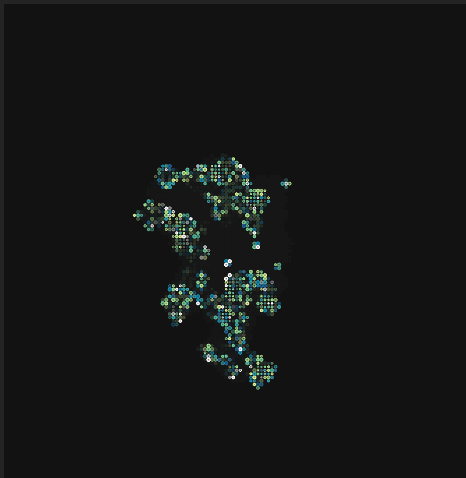

# Cellular Delirium

Random walkers spawn cells that evolve through Conway's Game of Life rules—cells survive with 2-3 neighbors, reproduce with exactly 3.

Cells grow as colored circles with random stroke weights and growth speeds, fading against a dark background.



## Installation

```bash
npm install
```

## Usage

Start the development server:

```bash
npm run dev
```

Then open your browser to the URL shown in the terminal (typically `http://localhost:5173/`).
